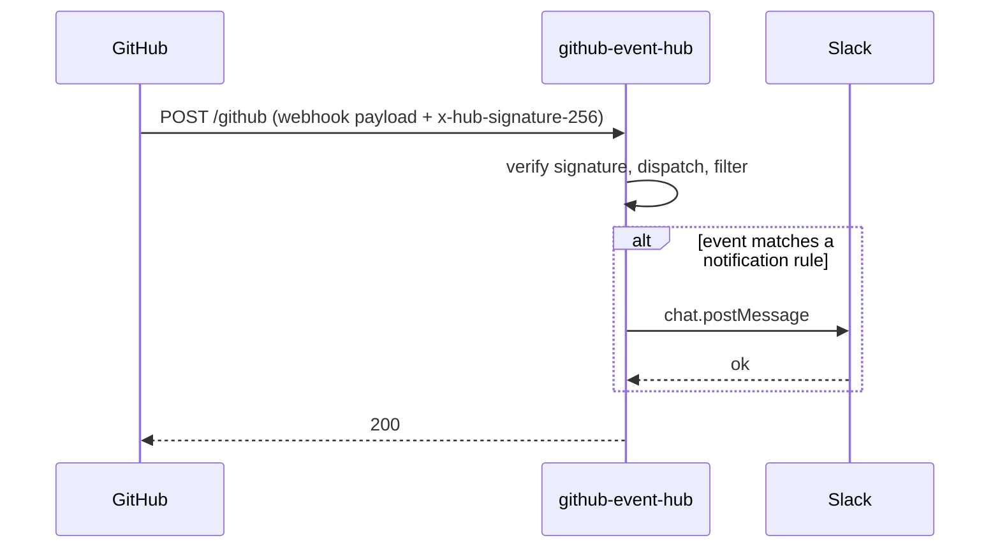

# Architecture

## Overview

github-event-hub is a single Hono HTTP service that receives GitHub webhooks, applies a small set of filters, and posts matching events to Slack.

## Request flow

1. GitHub delivers a webhook to `POST /github` with the headers `x-github-delivery`, `x-github-event`, and `x-hub-signature-256`. Missing any of these returns `400`.
2. `@octokit/webhooks` verifies the HMAC-SHA256 signature against `GITHUB_WEBHOOK_SECRET`. Failure returns `401`.
3. The raw body is parsed as JSON. Parse failure returns `400`.
4. `dispatch()` switches on the event name and runs the matching handler.
5. If the handler returns a notification, the Slack client posts it; otherwise the request is recorded as `filtered` or `ignored`.
6. Successful processing returns `200` with `{ ok: true, outcome }`. Any thrown error inside dispatch/handler is logged and also returned as `200` with `{ ok: false, outcome: "error" }` — this is intentional, because GitHub will redeliver any non-2xx response and the failures here are not transient.

## Notification rules

### `workflow_run`

A Slack message is posted only when **all** of the following are true:

- `action === "completed"`
- `workflow_run.conclusion === "failure"`
- `workflow_run.head_branch === repository.default_branch`
- `workflow_run.head_repository.full_name === repository.full_name` — excludes runs originating from forks, whose `head_branch` can collide with the upstream default branch name.

The message names the repo, workflow, branch, and short SHA, and links to the run page.

### `pull_request`

Handled for `action === "opened"` and `action === "closed"`, when at least one of:

- the PR title ends with `[security]` (matched by `/\[security\]\s*$/`), or
- the head branch matches `/^renovate\/.*-vulnerability$/`.

The message tags the PR as a security PR, includes the title, and links to the PR page. A coloured attachment border encodes the lifecycle state:

| State                    | Border colour | Slack action                                   |
| ------------------------ | ------------- | ---------------------------------------------- |
| opened                   | green         | `chat.postMessage`                             |
| merged (closed + merged) | purple        | `chat.update` on the original `opened` message |
| closed without merging   | red           | `chat.update` on the original `opened` message |

The link back to the original message uses Slack message metadata (`event_type: "security_pr"`, `event_payload: { pr_url }`). On a `closed` event the handler scans recent `conversations.history` of `SLACK_CHANNEL` for a matching metadata payload and edits that message in place. If no matching message is found (e.g. the original is past the history window, or the bot was offline when the PR was opened), the close notification is posted as a new message instead.

All other events and actions short-circuit to `ignored`.
