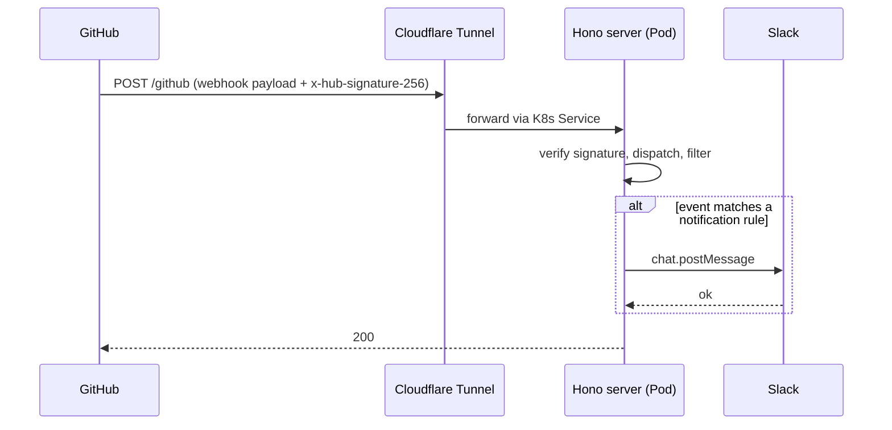

# Architecture

## Overview

github-event-hub is a single Hono HTTP service that receives GitHub webhooks from every repository in the `fohte` org, applies a small set of filters, and posts matching events to Slack. It runs as a two-replica Deployment on the `home-k8s` cluster and is reached from GitHub over a Cloudflare Tunnel.

## Request flow

1. GitHub delivers a webhook to `POST /github` with the headers `x-github-delivery`, `x-github-event`, and `x-hub-signature-256`. Missing any of these returns `400`.
2. `@octokit/webhooks` verifies the HMAC-SHA256 signature against `GITHUB_WEBHOOK_SECRET`. Failure returns `401`.
3. The raw body is parsed as JSON. Parse failure returns `400`.
4. `dispatch()` switches on the event name and runs the matching handler.
5. If the handler returns a notification, the Slack client posts it; otherwise the request is recorded as `filtered` or `ignored`.
6. Successful processing returns `200` with `{ ok: true, outcome }`. Any thrown error inside dispatch/handler is logged and also returned as `200` with `{ ok: false, outcome: "error" }` — this is intentional, because GitHub will redeliver any non-2xx response and the failures here are not transient.

## Notification rules

### `workflow_run`

A Slack message is posted only when **all** of the following are true:

- `action === "completed"`
- `workflow_run.conclusion === "failure"`
- `workflow_run.head_branch === repository.default_branch`
- `workflow_run.head_repository.full_name === repository.full_name` — excludes runs originating from forks, whose `head_branch` can collide with the upstream default branch name.

The message names the repo, workflow, branch, and short SHA, and links to the run page.

### `pull_request`

A Slack message is posted only when `action === "opened"` and at least one of:

- the PR title ends with `[security]` (matched by `/\[security\]\s*$/`), or
- the head branch matches `/^renovate\/.*-vulnerability$/`.

The message tags the PR as a security PR, includes the title, and links to the PR page.

All other events and actions short-circuit to `ignored`.

## Infrastructure

The runtime configuration lives in the [`infra` repository](https://github.com/fohte/infra) under `kubernetes/home/manifests/github-event-hub/`. This repository only ships the application and container image; everything below is owned by that chart.

- **Workload** — Helm-managed `Deployment` on the `home-k8s` cluster with `replicas: 2`.
- **Container image** — `ghcr.io/fohte/github-event-hub`, built by the release workflow in this repo. The running tag is overwritten by Argo CD Image Updater in the form `latest@sha256:...` whenever a new digest is published.
- **Ingress** — `github-event-hub.fohte.net` is fronted by a Cloudflare Tunnel running on `home-k8s`, which routes to the in-cluster `github-event-hub` Service. There is no authentication at the ingress layer; the application relies entirely on GitHub's HMAC signature.
- **Secrets** — `GITHUB_WEBHOOK_SECRET` and `SLACK_BOT_TOKEN` are stored in AWS SSM Parameter Store under `/infra/github-event-hub/{webhook-secret,slack-bot-token}` and synced into a Kubernetes `Secret` by External Secrets Operator.
- **Webhook distribution** — `terraform/github/modules/repository/main.tf` in the `infra` repository defines a `github_repository_webhook "github_event_hub"` that auto-registers this endpoint on every `fohte` repository. The shared HMAC secret is consumed by the `github` tfstate from the `home-k8s` tfstate output via `terraform_remote_state`, so the value stays in lock-step with what the running pods see.
